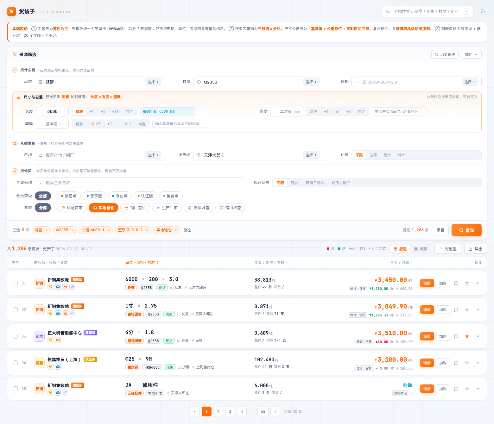
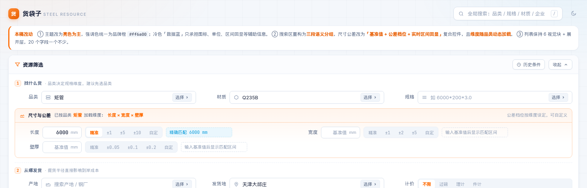
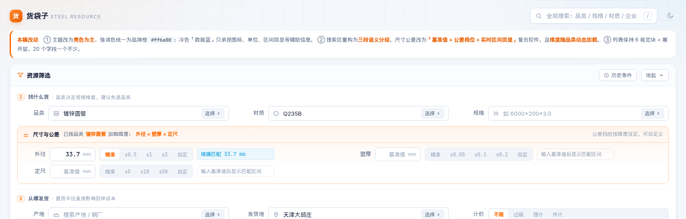
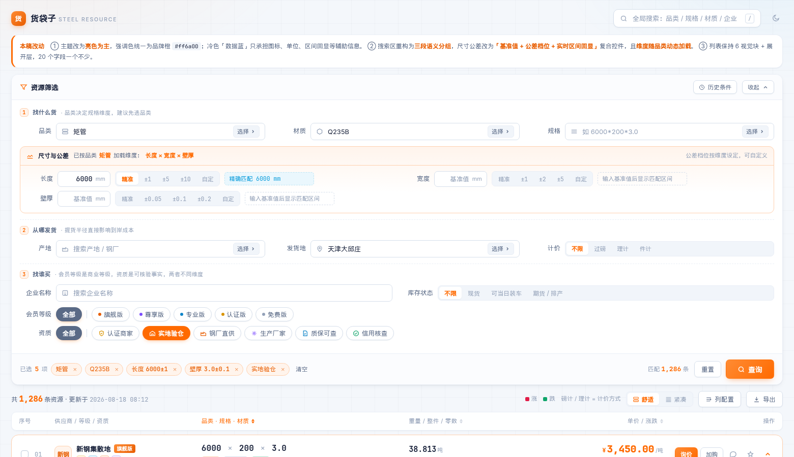
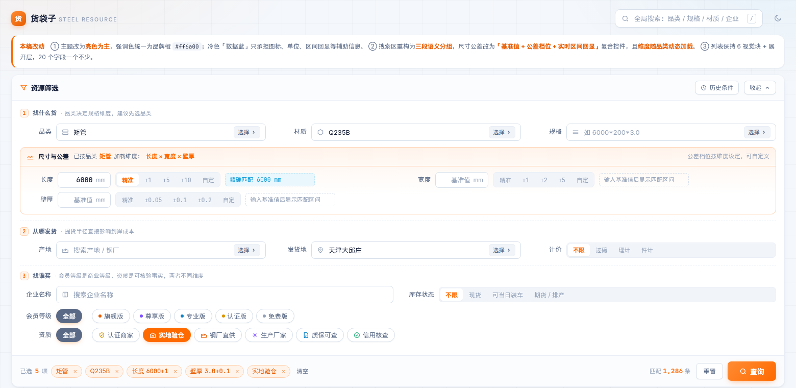
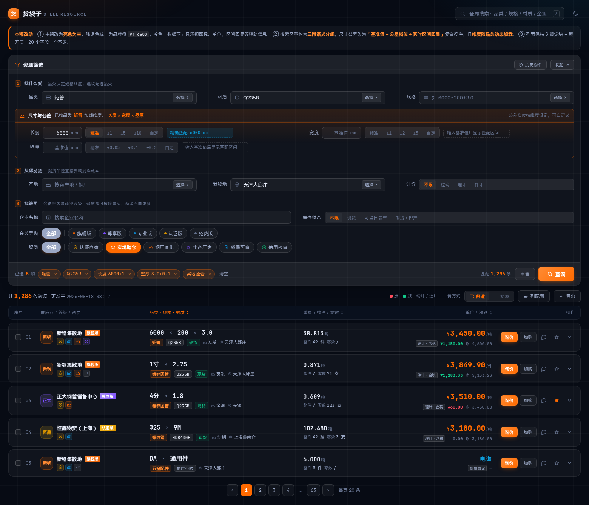
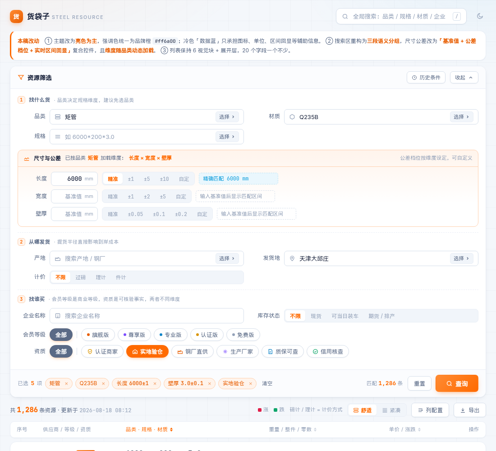

# 资源筛选 + 资源列表 · 重新设计说明（亮色版）

打开 `index.html` 即可查看高保真原型（单文件、零外部依赖、交互可点）。

**主题**：亮色为主，强调色统一为品牌橙 `#ff6a00`；深色为可选（右上角切换）。
冷色「数据蓝」`#0d9ddb` 只承担辅助信息（图标、单位、区间回显），不与品牌色争夺注意力。

## 效果预览

整页（亮色）



搜索区特写 —— 左：品类「矩管」加载 长度×宽度×壁厚；右：切到「镀锌圆管」自动变为 外径×壁厚×定尺，且各维度公差档位不同

| 矩管 | 镀锌圆管 |
|---|---|
|  |  |

| 展开层 | 紧凑表格视图 |
|---|---|
|  |  |

| 深色（可选） | 窄屏 1100px |
|---|---|
|  |  |

---

# 一、搜索条件区：问题诊断与重构

## 1.1 原设计的九个问题

| # | 问题 | 具体表现 | 根因 |
|---|---|---|---|
| 1 | 无逻辑分组 | 品类/规格/企业名称/材质/尺寸/产地/发货地/会员/资质 五行平铺，找一个条件要全屏扫视 | 按字段罗列，没有按用户的检索心智分组 |
| 2 | 公差控件选型错误 | `○精准 ○±1 ○±2 [请输入]` —— 先选档位再填值 | 心智顺序是「先有基准值，再谈允许偏差」，radio 在前是反的 |
| 3 | 「精准」被压成两行 | 单选项标签折成「精」「准」两行 | radio 组横向排列时未预留标签宽度 |
| 4 | 没有结果回显 | 用户填了 6000、选了 ±1，不知道实际会匹配 5999~6001 | 缺少即时反馈，参数类输入最忌讳这点 |
| 5 | 公差档位一套通用 | 长度和宽度都给 ±1/±2 | 不同维度量级差异极大：壁厚差 1mm 是完全不同的产品，定尺差 1mm 几乎无意义 |
| 6 | 维度固定为长/宽/壁厚 | 说明里写「比如矩管…」，但圆管没有长宽，是外径×壁厚×定尺 | 维度应由品类决定，写死三个对多数品类是错的 |
| 7 | 约束写在正文括号里 | 「（只有选择一个品类及规格后才支持应用范围）」 | 约束应该用禁用态表达，而不是让用户读说明 |
| 8 | 会员等级排布混乱 | 6 个版本两行、紫/橙/黄各一色，且与产地挤在同一行 | 会员等级（商业等级）与资质（可核验事实）是两个维度，被混排 |
| 9 | 橙色滥用 | 高亮底 + 主按钮 + 「选择▶」链接 + 单选选中 + 「查看历史条件」全是橙 | 强调色失去指示作用 |

## 1.2 重构方案

### ① 三段语义分组

按采购检索的真实心智拆成三步，每段带序号和一句说明：

```
① 找什么货   品类 · 材质 · 规格  →  尺寸与公差
② 从哪发货   产地 · 发货地 · 计价方式
③ 找谁买     企业名称 · 库存状态 · 会员等级 · 资质
```

### ② 尺寸公差控件重做：基准值 + 档位 + 实时区间

```
长度  [ 6000 ]mm   [精准|±1|±5|±10|自定]   精确匹配 6000 mm
宽度  [  200 ]mm   [精准|±1|±2|±5 |自定]   匹配 199 ~ 201 mm
壁厚  [  3.0 ]mm   [精准|±0.05|±0.1|±0.2|自定]  匹配 2.9 ~ 3.1 mm
```

- **顺序改为「先值后差」**，符合心智
- radio 换成分段控件，标签不再折行
- **右侧青色框实时回显生效区间**——这是原设计完全缺失、但对参数输入最关键的一环
- 「自定」档位支持上下限自由输入

### ③ 维度随品类动态加载（本次最实质的改进）

品类决定规格维度，写死「长/宽/壁厚」对多数钢材品类是错的：

| 品类 | 维度 | 公差档位（按维度差异化） |
|---|---|---|
| 矩管 | 长度 × 宽度 × 壁厚 | 长度 ±1/±5/±10 · 宽度 ±1/±2/±5 · 壁厚 ±0.05/±0.1/±0.2 |
| 方管 | 边长 × 壁厚 × 定尺 | 边长 ±1/±2/±5 · 壁厚 ±0.05/±0.1/±0.2 |
| 镀锌圆管 / 焊接钢管 | 外径 × 壁厚 × 定尺 | 外径 ±0.5/±1/±2 · 定尺 ±5/±10/±50 |
| 螺纹钢 | 直径 × 定尺 | 直径 ±1/±2 · 定尺 ±0.5/±1 m |
| 热轧卷板 | 厚度 × 宽度 | 厚度 ±0.02/±0.05/±0.1 |
| 中厚板 | 厚度 × 宽度 × 长度 | 厚度 ±0.1/±0.2/±0.5 |
| 角钢 | 边宽 × 厚度 × 定尺 | — |
| H 型钢 | 高 × 宽 × 腹板厚 | — |

> 原型中这张表在 JS 的 `DIM_MAP` 里，生产环境应做成后台可配置（品类 × 维度 × 档位）。

### ④ 约束用禁用态表达，不写在正文

未选品类时，尺寸区整块置灰并显示一行引导：「**请先选择品类**，系统会自动加载该品类对应的规格维度（如矩管为长×宽×壁厚，圆管为外径×壁厚×定尺）」。原来那段带括号的说明文字整段删除。

### ⑤ 会员等级与资质分离

- **会员等级**是商业等级 → 单行 chips，只有高等级用渐变，每项带一个小色点做区分，避免 6 个版本 6 种大色块
- **资质**是可核验事实 → 单行 chips + 图标，图标语义色与列表页完全一致（认证=金、验仓=蓝、直供=橙、厂家=紫、质保=蓝、信用=绿）

### ⑥ 「选择 ▶」收进输入框内

原来悬挂在输入框右侧的橙色文字链接造成视觉断裂，且橙色滥用。改为输入框内的标准下拉触发器（灰底小按钮，hover 才变橙）。

### ⑦ 新增已选条件回显条

底部常驻「已选 5 项」+ 可单独删除的条件标签 + 清空。用户随时知道当前生效了什么，这是原设计完全没有的。

### ⑧ 操作区主次分明

- `查询` 大号橙色主按钮，**带实时匹配条数**（匹配 1,286 条），减少无效查询
- `重置` 次要描边按钮
- `历史条件` / `收起` 移到面板右上角，不与主操作抢位

### ⑨ 橙色降噪

橙色只出现在三处：主按钮、选中态、价格。其余一律中性灰或数据蓝。

---

# 二、资源列表：20 字段重组为 6 视觉块

原列表把 20 个字段平铺成 20 列，低分辨率下规格被挤压，4 个彩色资质标签的视觉重量超过供应商名称。

## 2.1 主行（始终可见）

| 视觉块 | 承载字段 | 手法 |
|---|---|---|
| ① 序号 | 序号 + 勾选 | 等宽字体、低对比 |
| ② 供应商身份 | 供应商 · 等级 · 资质 | 三字段合一：头像 + 名称 + 等级徽章，资质降为 19px 图标 + 悬浮释义 |
| ③ 货物 | **规格** · 品类 · 材质 · 产地 · 发货地 | 规格 16px 等宽粗体做主角，其余降为一行小标签 |
| ④ 数量 | 重量 · 整件 · 零数 | 重量为主，整件零数为副行 |
| ⑤ 价格 | **单价** · 昨日价格 · 计价方式 | 20px 橙色数字右对齐 + 计价方式 + 涨跌 + 昨日价，四者同区形成完整语义 |
| ⑥ 操作 | 操作 | 主操作「询价」渐变按钮，次要降为图标 |

## 2.2 展开层

包装数量、数量、整件/零数、**单位磅重**、**负差**、昨日价格、产地、发货地、更新时间 → 九宫格；**备注**单独成条（蓝色提示块，因为备注常含磅差处理、开票、加工等关键约定）。

## 2.3 关键决策

- **规格用等宽字体**：数字对齐后跨行扫视可瞬间比对，普通无衬线字体做不到
- **补上「计价方式」常驻标注**：磅计与理计差价可达每吨数十元，原列表把它埋在备注里
- **负差在展开层红色高亮**：`-3.0%` / `-0.15mm` / `足厚` 三态区分，这是钢管与螺纹钢采购的争议高发字段
- **涨跌红涨绿跌**，且始终带 ▲▼ 符号，不依赖颜色单独传递信息
- **双视图**：舒适（卡片行，浏览决策）/ 紧凑（真表格，20 列可显隐、左列冻结、横向滚动）——解决字段多的正解是给选择权，不是压缩
- **列配置抽屉**：核心 6 字段锁定，其余 13 个可勾选，关闭的仍可在展开层查看

---

# 三、亮色下如何做出"科技感"

亮色比深色更难出科技感（容易变成扁平的后台管理系统）。手法：

1. **底不用纯白**：`#f4f7fb` 打底 + 极淡冷暖双光斑 + 46px 细网格，避免刺眼与空洞
2. **数据感来自排版而非颜色**：所有数值 `tabular-nums` + 等宽字体，跨行严格对齐
3. **细描边 + 极轻投影**：`1px` 边框配 `0 4px 14px -6px` 级投影，不用大圆角大阴影（那是消费级 App 的语言）
4. **毛玻璃只用于 sticky 层**：表头、批量条
5. **强调色极度节制**：橙色仅主按钮 / 选中态 / 价格
6. **辅助信息统一用数据蓝**：图标、单位、区间回显、备注块
7. **行 hover 用左侧 2.5px 品牌色指示条**，比整行变色更轻

---

# 四、响应式降维顺序

**规格 / 单价 / 供应商名在任何宽度下都不隐藏。**

| 断点 | 筛选区 | 列表 |
|---|---|---|
| ≤1400px | 字段网格 3 列 → 2 列 | 隐藏「加购」次要按钮 |
| ≤1180px | — | 隐藏产地/发货地（转入展开层）、隐藏头像、资质折叠为 `+N` |
| ≤980px | 字段网格 → 1 列，公差 → 1 列 | 数量块下沉为货物块副行 |
| ≤760px | 标签宽度收窄，公差换行 | 转纵向卡片：规格整行大字，单价右上角，操作独立一行 |

---

# 五、顺带修掉的两点

- **去掉平铺水印**：原图密集斜向水印严重干扰数字阅读，而列表最核心的就是读数字。防爬建议改为登录后可见完整价格 + 接口限流 + 单账号浏览频次监控。
- **新增批量能力**：勾选多行浮出操作条，支持批量询价 / 加入采购单 / 对比 —— 钢贸采购常一次凑多个规格，逐条询价效率过低。
