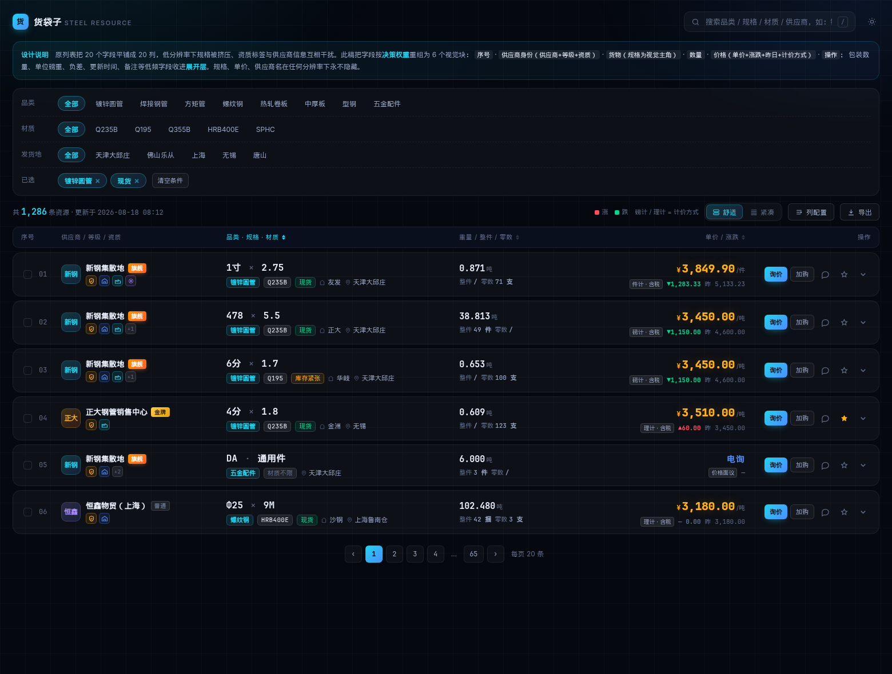
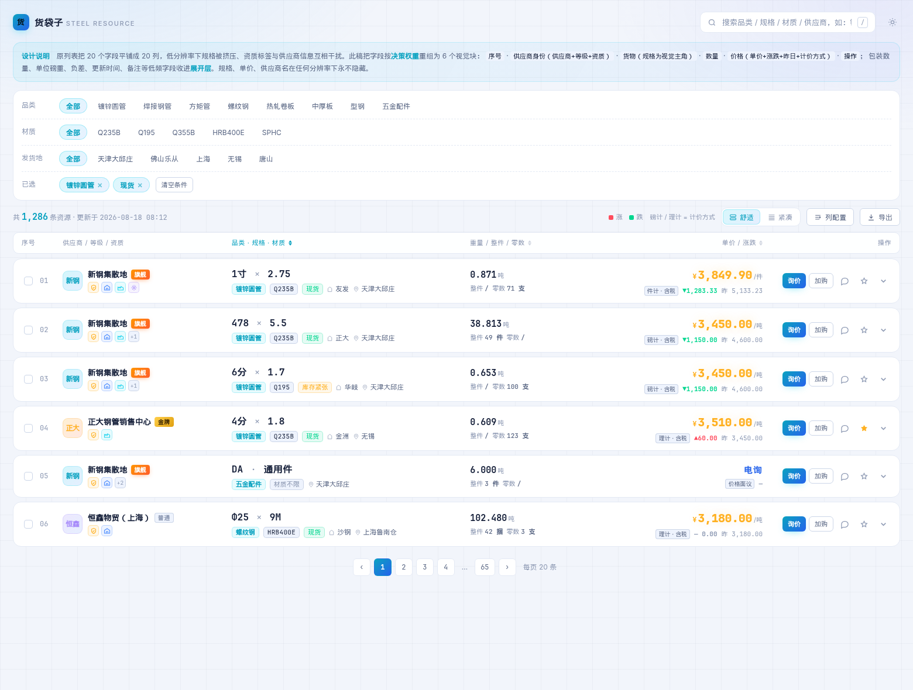
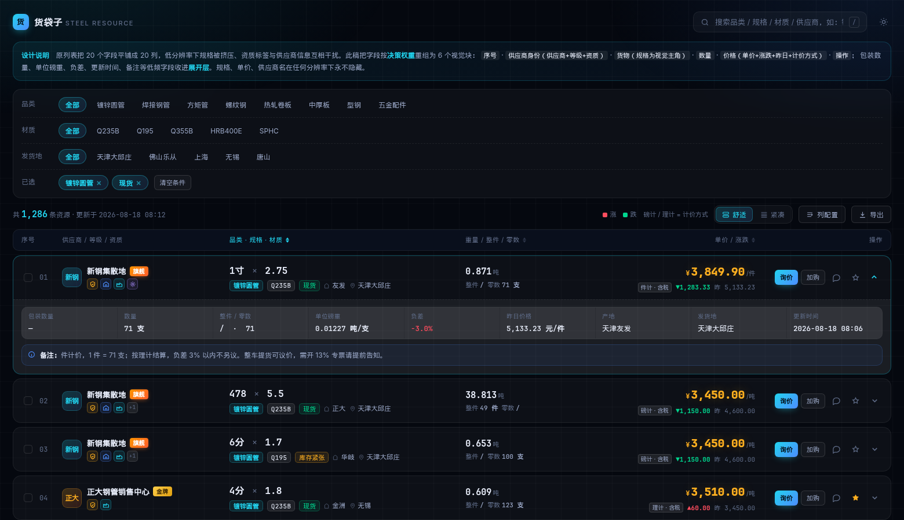
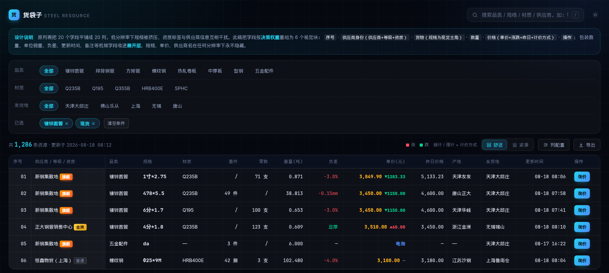
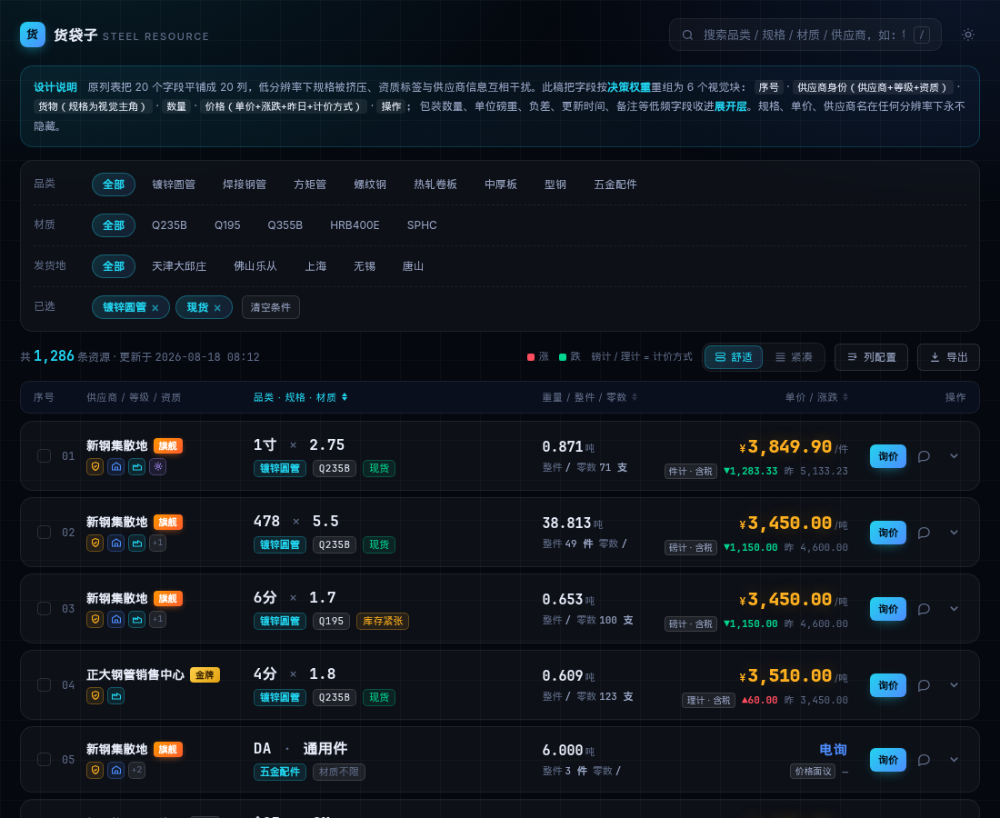

# 资源列表 · 重新设计说明

打开 `index.html` 即可查看高保真原型（单文件、无外部依赖、支持深/浅双主题）。

## 效果预览

| 深色（默认·科技风） | 浅色 |
|---|---|
|  |  |

| 展开层（低频字段 + 备注） | 紧凑表格视图（列可显隐 + 左列冻结） |
|---|---|
|  |  |

窄屏 1100px 降维（产地/发货地先让位，规格与单价保持完整）：

---

## 一、原列表的四个问题

| 问题 | 具体表现 | 根因 |
|---|---|---|
| 规格被挤压 | 分辨率一小，最关键的「1寸*2.75」就看不见了 | 20 个字段平铺成 20 列，每列都在争夺同等宽度，没有优先级 |
| 资质区块喧宾夺主 | 4 个彩色文字标签（认证商家/实地验仓/钢厂直供/生产厂家）堆成 2×2 方阵，视觉重量超过供应商名称 | 资质用了「彩色文字标签」这种高视觉权重的表达 |
| 供应商信息被割裂 | 供应商、等级、资质是三个独立列，本质上却是同一件事（对手方身份） | 按数据字段分列，而不是按用户的认知单元分组 |
| 价格信息层级混乱 | 「3,849.90元/件」和绿色「↓1283.33」挤在一格，昨日价格另开一列，看不出对比关系 | 价格、计价方式、涨跌、参考价被拆散在不同列 |

一句话概括：**这是一张按「数据库字段」组织的表，不是按「采购决策路径」组织的表。**

---

## 二、重新规划：把 20 个字段重组为 6 个视觉块

钢铁采购的扫视顺序是：**规格对不对 → 价格多少 → 有多少货 → 谁在卖、靠不靠谱 → 其他细节**。设计按这个顺序分配视觉权重。

### 主行（始终可见，6 块）

| 视觉块 | 承载字段 | 设计手法 |
|---|---|---|
| ① 序号 | 序号 + 勾选框 | 等宽字体、低对比度，只做定位不抢注意力 |
| ② 供应商身份 | 供应商、**等级**、**资质** | 三字段合并：头像 + 名称 + 等级徽章一行，资质降为 19px 图标行并加悬浮释义 |
| ③ 货物 | **规格**、品类、材质、产地、发货地 | **规格用 16px 等宽粗体做视觉主角**，其余降为一行小号标签/图标文字 |
| ④ 数量 | 重量、整件、零数 | 重量为主（15px 等宽），整件/零数为副行 |
| ⑤ 价格 | **单价**、昨日价格、计价方式 | 20px 金色发光数字右对齐；下方一行放「磅计/理计·含税」+ 涨跌 + 昨日价，形成完整对比关系 |
| ⑥ 操作 | 操作 | 主操作「询价」用渐变主按钮，次要操作降为图标按钮 |

### 展开层（点击箭头展开，低频字段）

包装数量、数量、整件/零数明细、**单位磅重**、**负差**、昨日价格、产地、发货地、更新时间 —— 九宫格陈列；**备注**单独成条（蓝色提示块，因为备注常包含磅差处理、开票、加工等关键约定，值得独立视觉位）。

> 20 个字段一个不少，但同屏视觉元素从 20 个降到 6 个。

---

## 三、关键设计决策及理由

**1. 规格是视觉主角，且永不隐藏。** 用等宽字体（`1寸 × 2.75`、`478 × 5.5`、`Φ25 × 9M`）——等宽字体让数字对齐，跨行扫视时同类规格能瞬间对比，这是普通无衬线字体做不到的。乘号用浅色 `×` 分隔，比原来的 `*` 更易读。

**2. 资质从「彩色文字标签」降为「图标 + tooltip」。** 资质的作用是给信心，不是给信息——买方只需要知道「有没有」，不需要每次都读全文。4 个图标占 88px，原方案占约 150px 宽 × 2 行，且视觉噪声大幅下降。图标各自保留语义色（认证=金、验仓=蓝、直供=青、厂家=紫），悬浮显示完整释义。

**3. 价格块承载四个字段，形成完整语义。** 「¥3,849.90 /件」+「件计·含税」+「▼1,283.33」+「昨 5,133.23」——四者放在一起，买方一眼能读懂「今天多少、怎么计价、比昨天降了多少」。原方案里昨日价格另开一列，涨跌和单价挤在一格，语义是断裂的。涨跌沿用国内行情惯例：**红涨绿跌**。

**4. 补上了「计价方式」这个钢铁场景的关键标注。** 磅计与理计的差价可达每吨数十元，原列表把它埋在备注里。这里做成价格下方的常驻小标签。

**5. 负差在展开层用红色高亮。** 负差直接影响实收重量，是钢管/螺纹钢采购的争议高发字段，值得视觉强调（`-3.0%` / `-0.15mm` / `足厚` 三态区分）。

**6. 双视图并存。** 「舒适」= 卡片行（默认，适合浏览决策）；「紧凑」= 真表格（适合老手批量比价，左侧序号与供应商列冻结、横向滚动、20 列可自由显隐）。**这是解决「字段多」的正解——不是压缩，而是给用户选择权。**

**7. 列配置抽屉。** 核心 6 字段锁定不可关，其余 13 个字段分组可勾选，关闭的字段仍能在展开层查到，不会丢信息。

---

## 四、响应式降维顺序

低分辨率下按决策权重逐级让位，**规格 / 单价 / 供应商名在任何宽度下都不隐藏**：

| 断点 | 动作 |
|---|---|
| ≤1400px | 隐藏「加购」次要按钮，压缩列宽 |
| ≤1180px | 隐藏产地/发货地（转入展开层）、隐藏供应商头像、资质超过 3 个折叠为 `+N` |
| ≤980px | 数量块下沉为货物块的副行 |
| ≤760px | 转为纵向卡片：规格整行大字，单价右上角，操作独立一行 |

---

## 五、科技风的具体实现（避免"炫技但难用"）

- **底层**：深色 `#05080f` + 44px 网格纹 + 青/蓝双色径向光斑，克制到不干扰阅读
- **发光**：只用在价格数字（金色 text-shadow）和主按钮（青蓝渐变 + 投影），其他一律不发光——**发光是稀缺资源，滥用就失去指示作用**
- **行 hover**：左侧 2px 青蓝渐变指示条 + 背景微提亮，比整行变色更轻盈
- **等宽数字**：所有数值用 `tabular-nums` + 等宽字体，保证跨行对齐
- **玻璃拟态**：仅用于 sticky 表头和批量操作条（`backdrop-filter: blur`）
- **浅色主题**：右上角可切换。钢贸用户白天在办公室、或需要打印/截图给客户时，浅色更实用——科技风不等于只能深色

## 六、顺带修掉的两个体验问题

- **去掉了平铺水印**。原图密集的斜向水印严重干扰数字阅读。防爬建议改为：登录后可见完整价格、接口限流、单账号浏览频次监控，而不是牺牲所有正常用户的可读性。
- **补充了批量能力**。勾选多行后浮出操作条，支持批量询价、加入采购单、横向对比——钢贸采购常常一次要凑多个规格，逐条询价效率很低。
