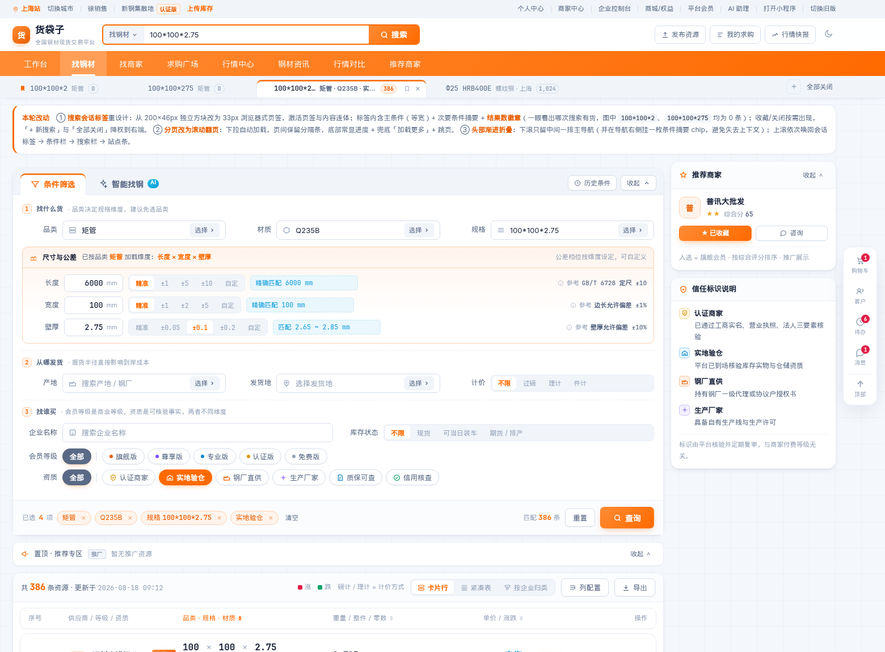
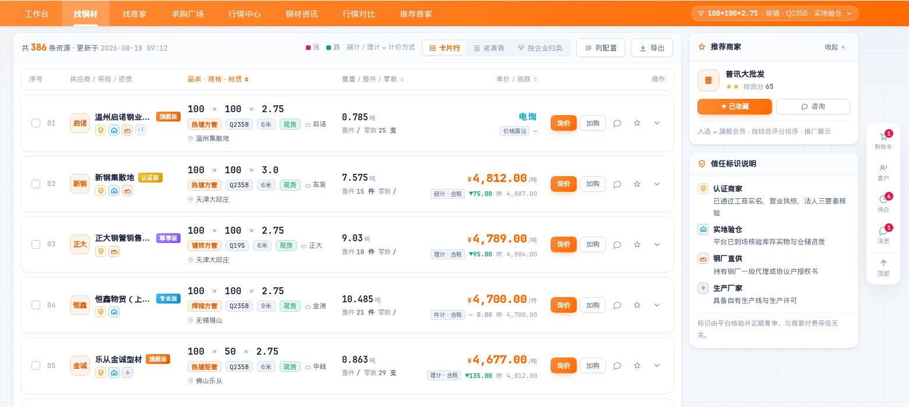
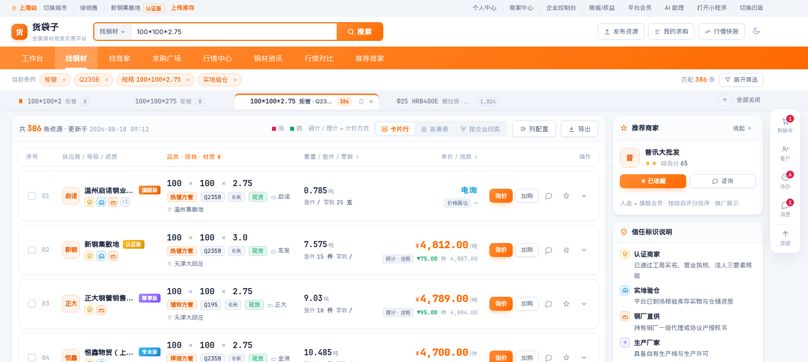
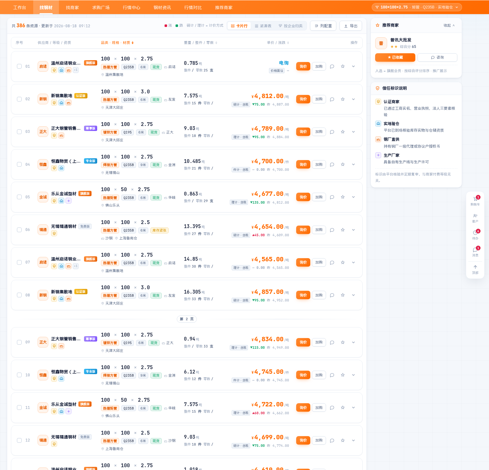
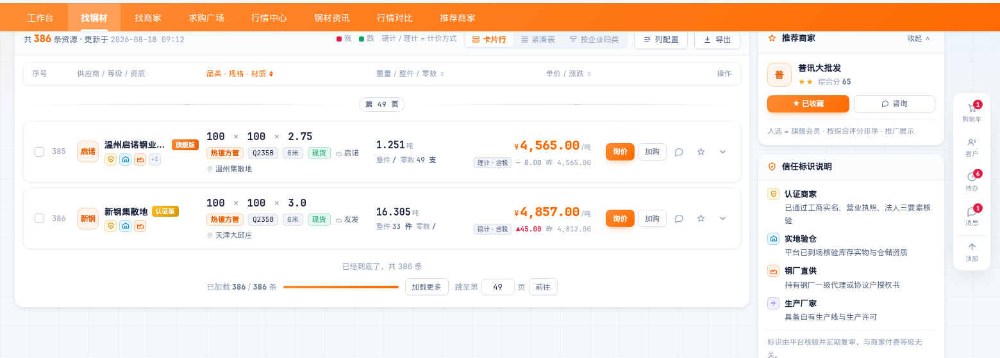
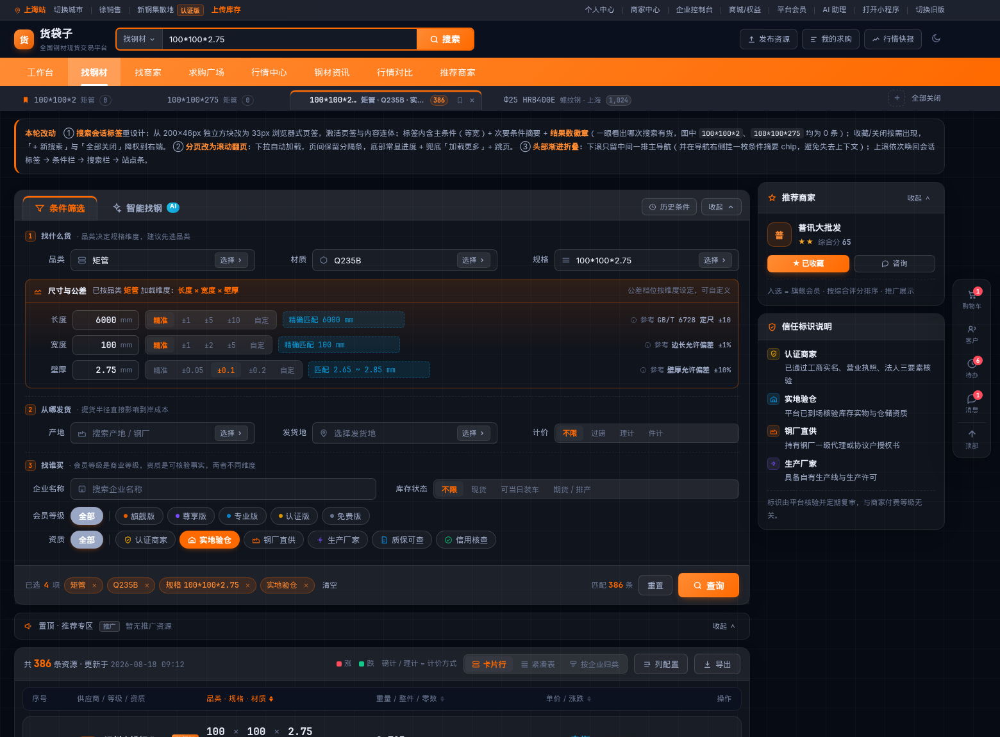
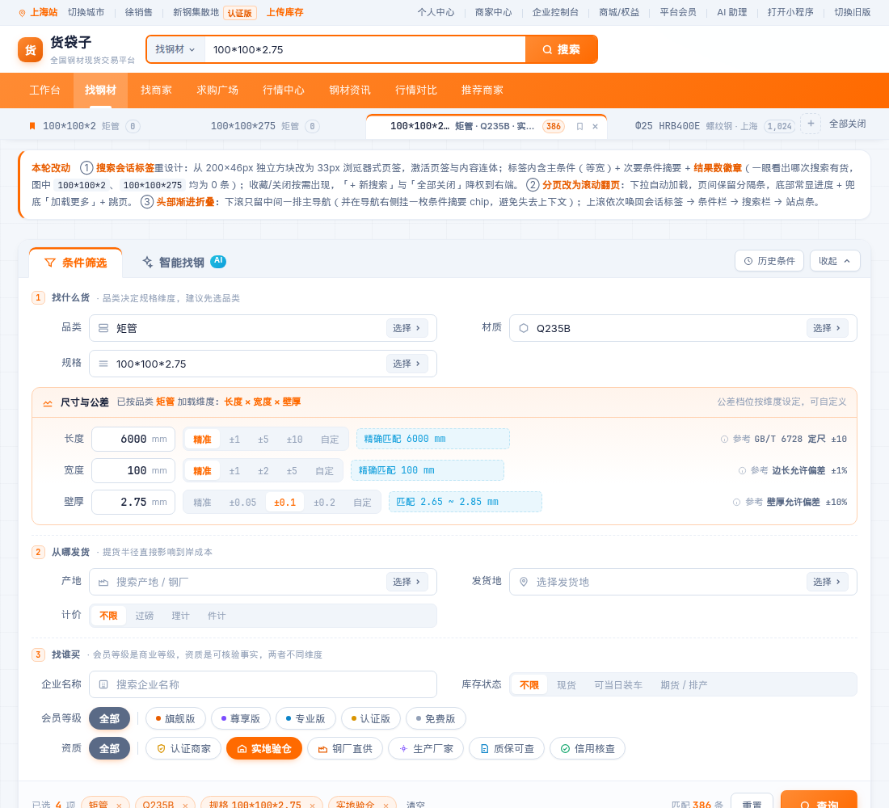

# 找钢材页 · 重新设计说明（亮色版）

打开 `index.html` 即可查看高保真原型（单文件、零外部依赖、交互可点）。

本稿累计解决四类问题，按加入顺序倒序排列（新的在前）：

| 章节 | 问题 |
|---|---|
| [一](#一搜索会话标签每次搜索生成一个) | 搜索会话标签又丑又占地、无法区分、看不出哪次搜索有货 |
| [二](#二分页改为滚动翻页) | 点击分页改为滚动翻页，同时保留「第几页」的坐标感与跳页能力 |
| [三](#三头部渐进折叠) | 下滚只留主导航，上滚唤回搜索/条件/标签 |
| [四](#四割裂感的根因与解法上一轮) | 页签与内容割裂 —— 根因是「一件事被切成了多张卡」 |
| [五](#五搜索条件区问题诊断与重构) | 筛选区五行平铺、公差控件选型错误、维度写死 |
| [六](#六资源列表20-字段重组为-6-视觉块) | 20 个字段平铺成 20 列，规格被挤压 |

**主题**：亮色为主，强调色统一为品牌橙 `#ff6a00`；深色为可选（右上角切换）。
冷色「数据蓝」`#0d9ddb` 只承担辅助信息（图标、单位、区间回显），不与品牌色争夺注意力。

## 效果预览

页面顶部（头部五层全展开：站点条 / 搜索栏 / 主导航 / 会话标签 / 找货卡）



搜索会话标签特写 —— 33px 浏览器式页签，激活页签与内容连体，带结果数徽章


| 下滚：只保留中间一排主导航（右侧挂条件摘要 chip） | 上滚：会话标签 / 条件栏 / 搜索栏 / 站点条 依次唤回 |
|---|---|
|  |  |

滚动翻页：页间保留「第 N 页」分隔条



| 滚动到末页：进度 + 兜底加载 + 跳页 | 「智能找钢」页签（AI 需求标准化） |
|---|---|
|  |  |

| 深色（可选） | 窄屏 1100px |
|---|---|
|  |  |

---

# 一、搜索会话标签（每次搜索生成一个）

## 1.1 原设计的六个问题

| # | 问题 | 说明 |
|---|---|---|
| 1 | 尺寸失控 | 每个标签是 ~200×46px 的独立方块，一排就吃掉整行高度；标签本身比它代表的搜索结果更抢眼 |
| 2 | 又是浮动块 | 标签各自有圆角边框、彼此有间隙，与下方结果区完全不连体 —— 和上一轮页签同一个病 |
| 3 | 内容冗余且无法区分 | 三个标签都是「规格：100\*100\*2」「规格：100\*100\*275」「规格：100\*100\*2.75」，`规格：` 前缀重复，实际搜索还带品类/材质/资质等条件却一个都没显示 |
| 4 | 操作按钮在对角线上 | 关闭 `×` 在右上角，保存图标在右下角，视线要在方块里来回跳 |
| 5 | 没有结果数 | 用户无法判断哪一次搜索有货 —— 而这恰恰是最想知道的（图中两个相邻规格其实是 0 条） |
| 6 | 「关闭全部」权重过高 | 被做成和标签同样大的方块，看起来像第四个标签 |

## 1.2 重设计

```
┌──────────────────────────────────────────────────────────────────────────┐
│ ⚑100*100*2 矩管 ⓿ │ 100*100*275 矩管 ⓿ │▎100*100*2.75 矩管·Q235B·实地验仓 386 ★×│ … │ + 全部关闭 │
└──────────────────────────────────────────────────────────────────────────┘
                                        ↑ 激活页签与下方内容连体，顶部 2.5px 橙条
```

| 改动 | 做法 |
|---|---|
| 高度 46 → **33px** | 一排标签只占 38px 层高，不再抢戏 |
| **与内容连体** | 激活页签同底色 + 底边染成面板色 + `margin-bottom:-1px` 吃掉接缝线 + 顶部 2.5px 品牌色指示条（与「条件筛选/智能找钢」页签同一套语言） |
| 内容分主次 | 主条件用**等宽字体**（`100*100*2.75`，规格对齐易比对）+ 次要条件摘要（`矩管 · Q235B · 实地验仓`，灰色可省略号截断）；删掉 `规格：` 前缀 |
| 新增**结果数徽章** | 激活页签为橙底，未激活为灰底；**0 条时用空心样式**，一眼看出这次搜索没货 |
| 操作合并到右端 | 收藏 `★` 与关闭 `×` 并排放在标签右侧，**hover 或激活时才出现**，静止状态干净 |
| 已收藏可视化 | 标签左端出现一枚橙色书签角标 |
| 尾部降权 | `+ 新搜索` 用虚线小方钮，`全部关闭` 降为文字按钮 |
| 标签过多 | 标签条横向滚动（隐藏滚动条），单个标签最大 300px 内部截断 |

> 实现注意：原型最初把 `.stab` 写成 `<button>` 并在里面嵌了收藏/关闭两个 `<button>`，HTML 不允许按钮嵌套，浏览器会把内层按钮拆到外面（渲染成标签后面多出两个游离图标）。已改为 `<div role="tab" tabindex="0">`。

---

# 二、分页改为滚动翻页

## 2.1 做法

- **下拉自动加载**：滚动到距底 700px 时预取下一页，每页 8 条，带加载态（`正在加载第 N 页…`）
- **保留分页语义**：页与页之间插入 `— 第 N 页 —` 分隔条。无限滚动最大的问题是用户失去位置感，分隔条把「第几页」这个坐标还回去
- **底部常显状态栏**：`已加载 24 / 386 条` + 进度条 + **兜底「加载更多」按钮**（自动加载失败或用户想手动控制时可用）+ **跳页输入框**（无限滚动通常丢掉了「直接去第 30 页」的能力，这里补回来）
- **到底提示**：`已经到底了，共 386 条`，加载按钮置灰
- **回到顶部**：并入右侧悬浮坞底部

## 2.2 为什么不做成纯无限滚动

纯无限滚动在 B2B 采购场景有三个硬伤，都用上面的设计补掉了：无法回答「我看到第几页了」、无法直接跳页、页脚永远够不到。**滚动是交互方式，分页是信息坐标，两者不冲突。**

---

# 三、头部渐进折叠

## 3.1 五层结构与三种状态

```
L1 站点条（上海站 / 账号 / 上传库存 / 个人中心…）   32px
L2 搜索栏（Logo + 全局搜索 + 快捷入口）             58px
L3 主导航（工作台 找钢材 找商家 …）                 44px  ← 常驻
L4 条件栏（当前条件 chips + 匹配数 + 展开筛选）      40px
L5 搜索会话标签                                     38px
```

| 状态 | 触发 | 显示 |
|---|---|---|
| `top` | 滚动位置 < 40px | L1 + L2 + L3 + L5，**L4 隐藏**（完整筛选面板就在下方，避免重复） |
| `down` | 向下滚动（阈值 6px） | **只有 L3 主导航** |
| `up` | 向上滚动（阈值 6px） | L1 + L2 + L3 + L4 + L5 全部唤回 |

阈值 6px 用于抑制微小抖动导致的反复展开收起；`requestAnimationFrame` 节流。

## 3.2 两个必须补的设计（否则折叠会伤体验）

**① 折叠后要留条件上下文。** 条件全部隐藏后，用户会不知道当前看的是哪次搜索的结果。所以下滚态在主导航右侧挂一枚条件摘要 chip：`⚑ 100*100*2.75 · 矩管 · Q235B · 实地验仓`。点它会把头部钉住展开 3 秒，可直接改条件。这一枚 chip 仍在主导航那一行内，没有增加层数。

**② 上滚唤回的是「一行条件栏」，不是 400px 完整面板。** 完整筛选面板高约 400px，如果跟着上滚吸顶会瞬间遮住半屏，反而更糟。所以吸顶态用 40px 的条件栏（已选条件 chips + 匹配条数 + 「展开筛选」按钮）替代；需要完整面板时点「展开筛选」回到顶部，或直接滚到顶。

## 3.3 吸顶层级的连带调整

- 结果表头 `.thead` 的 `top` 从 `0` 改为 `calc(var(--h-nav) + 2px)`，避免与常驻主导航重叠
- 右栏 sticky 同样偏移
- 各层高度集中在 CSS 变量 `--h-site / --h-search / --h-nav / --h-cond / --h-stabs`，折叠动画与吸顶偏移共用同一组值，避免改一处漏一处

---

# 四、割裂感的根因与解法（上一轮）

## 4.1 诊断：不是按钮样式问题，是「一件事被切成了多张卡」

「条件筛选 / 智能找钢」两个页签与下方内容读起来互不相关，直接原因有三层：

| 层次 | 问题 |
|---|---|
| 表层 | 两个页签是**独立浮动药丸**，各自有圆角、边框、投影，与它所控制的面板之间还有间距 —— 视觉上是「两个按钮」而不是「面板的页签」 |
| 中层 | 页签容器和筛选卡各有一套顶部圆角与边框，形成**双容器套嵌** |
| 深层（根因） | **一个任务被切成了多张卡**：找货 = 页签卡 + 筛选卡；看结果 = 视图切换（浮动 seg）+ 表格卡 + 分页。整页碎成 6 个独立白块，每块都有自己的圆角和阴影 |

## 4.2 解法：建立「一个任务 = 一个容器」规则

```
┌─ 找货卡（一个容器） ────────────────────────────────┐
│ [条件筛选] [智能找钢 AI]         历史条件   收起 ∧  │ ← 连体页签
├─────────────────────────────────────────────────────┤
│  ① 找什么货 / ② 从哪发货 / ③ 找谁买                 │ ← 或 AI 面板
├─────────────────────────────────────────────────────┤
│ 已选 5 项 …              匹配 1,286 条  重置  查询  │
└─────────────────────────────────────────────────────┘
  置顶·推荐专区  [推广]  暂无推广资源            收起 ∧   ← 无数据压成一行
┌─ 结果卡（一个容器） ────────────────────────────────┐
│ 共1,286条  [卡片行|紧凑表|按企业归类] 列配置 导出   │ ← 视图切换收进卡内
├─────────────────────────────────────────────────────┤
│ 表头 / 列表行 / 展开层                              │
│ 分页                                                │
└─────────────────────────────────────────────────────┘
```

## 4.3 连体页签的具体做法

```css
.tabbar{ background:var(--surface-3); border-bottom:1px solid var(--line); }

.tab[aria-selected="true"]{
  background:var(--surface);              /* ① 与面板同底色 */
  border:1px solid var(--line);
  border-bottom-color:var(--surface);     /* ② 底边染成面板色 */
  margin-bottom:-1px;                     /* ③ 负 1px 吃掉容器底边线 */
  box-shadow:inset 0 2.5px 0 var(--brand);/* ④ 顶部品牌色指示条 */
}
```

四步的作用：①②③ 让激活页签与面板之间的**接缝线彻底消失**，形成物理连体；④ 用 2.5px 顶部指示条承担「当前选中」的信号，替代原来的整块橙色填充 —— **页签不需要像按钮那样抢眼，它只需要标明位置。**

未激活页签保持透明底（融入灰色页签栏），hover 才浮起半透明白，与激活态形成清晰的层级差。

## 4.4 同批修掉的三个连带问题

| 问题 | 原状 | 改法 |
|---|---|---|
| 推广位空态占首屏 | 「暂无数据」占据约 100px 高的空白卡，把真正的资源列表挤到折叠线以下 | 无数据时压缩为 42px 单行；有数据才展开为卡片。**推广位永远不该比资源列表更靠前** |
| 视图切换浮在卡外 | 卡片/列表/按企业归类 是独立浮动块，与表格分离 | 收进结果卡的工具条，与条数、图例、列配置、导出同一行 |
| 右侧悬浮坞压住表格 | 购物车/客户/待办/消息 四个圆钮直接盖在内容上 | 收进一个独立坞容器，`≥1280px` 时给页面留 86px 安全边距，`<1280px` 直接隐藏 |

## 4.5 「智能找钢」面板

页签既然存在，就要给出两种模式的实质差异，否则页签本身也是割裂的来源。智能找钢面板落地的是需求标准化：

- 自然语言输入（`四百螺 二五 两百吨 唐山提 过磅含税 本周要，要质保书，能开专票`）
- 支持上传 Excel / 图片清单、语音输入
- AI 解析成**可逐项编辑的槽位**：品类 / 材质 / 规格 / 数量 / 提货 / 计价 / 附加
- **缺失要素橙色虚线高亮**（例：交货日期待补充），并给出「补充后可提高报价准确度」的理由
- 显示**要素齐备度 5/6**（这个指标同时是意向评分的主特征）
- 出口是两个：`直接搜索匹配货源` 和 `匿名发布询单`

同时把共用底栏在 AI 页签下隐藏，避免「查询」与「匿名发布询单」形成双 CTA。

---

# 五、搜索条件区：问题诊断与重构

## 5.1 原设计的九个问题

| # | 问题 | 具体表现 | 根因 |
|---|---|---|---|
| 1 | 无逻辑分组 | 品类/规格/企业名称/材质/尺寸/产地/发货地/会员/资质 五行平铺，找一个条件要全屏扫视 | 按字段罗列，没有按用户的检索心智分组 |
| 2 | 公差控件选型错误 | `○精准 ○±1 ○±2 [请输入]` —— 先选档位再填值 | 心智顺序是「先有基准值，再谈允许偏差」，radio 在前是反的 |
| 3 | 「精准」被压成两行 | 单选项标签折成「精」「准」两行 | radio 组横向排列时未预留标签宽度 |
| 4 | 没有结果回显 | 用户填了 6000、选了 ±1，不知道实际会匹配 5999~6001 | 缺少即时反馈，参数类输入最忌讳这点 |
| 5 | 公差档位一套通用 | 长度和宽度都给 ±1/±2 | 不同维度量级差异极大：壁厚差 1mm 是完全不同的产品，定尺差 1mm 几乎无意义 |
| 6 | 维度固定为长/宽/壁厚 | 说明里写「比如矩管…」，但圆管没有长宽，是外径×壁厚×定尺 | 维度应由品类决定，写死三个对多数品类是错的 |
| 7 | 约束写在正文括号里 | 「（只有选择一个品类及规格后才支持应用范围）」 | 约束应该用禁用态表达，而不是让用户读说明 |
| 8 | 会员等级排布混乱 | 6 个版本两行、紫/橙/黄各一色，且与产地挤在同一行 | 会员等级（商业等级）与资质（可核验事实）是两个维度，被混排 |
| 9 | 橙色滥用 | 高亮底 + 主按钮 + 「选择▶」链接 + 单选选中 + 「查看历史条件」全是橙 | 强调色失去指示作用 |

## 5.2 重构方案

### ① 三段语义分组

按采购检索的真实心智拆成三步，每段带序号和一句说明：

```
① 找什么货   品类 · 材质 · 规格  →  尺寸与公差
② 从哪发货   产地 · 发货地 · 计价方式
③ 找谁买     企业名称 · 库存状态 · 会员等级 · 资质
```

### ② 尺寸公差控件重做：基准值 + 档位 + 实时区间

```
长度  [ 6000 ]mm   [精准|±1|±5|±10|自定]   精确匹配 6000 mm
宽度  [  200 ]mm   [精准|±1|±2|±5 |自定]   匹配 199 ~ 201 mm
壁厚  [  3.0 ]mm   [精准|±0.05|±0.1|±0.2|自定]  匹配 2.9 ~ 3.1 mm
```

- **顺序改为「先值后差」**，符合心智
- radio 换成分段控件，标签不再折行
- **右侧青色框实时回显生效区间**——这是原设计完全缺失、但对参数输入最关键的一环
- 「自定」档位支持上下限自由输入

### ③ 维度随品类动态加载（本次最实质的改进）

品类决定规格维度，写死「长/宽/壁厚」对多数钢材品类是错的：

| 品类 | 维度 | 公差档位（按维度差异化） |
|---|---|---|
| 矩管 | 长度 × 宽度 × 壁厚 | 长度 ±1/±5/±10 · 宽度 ±1/±2/±5 · 壁厚 ±0.05/±0.1/±0.2 |
| 方管 | 边长 × 壁厚 × 定尺 | 边长 ±1/±2/±5 · 壁厚 ±0.05/±0.1/±0.2 |
| 镀锌圆管 / 焊接钢管 | 外径 × 壁厚 × 定尺 | 外径 ±0.5/±1/±2 · 定尺 ±5/±10/±50 |
| 螺纹钢 | 直径 × 定尺 | 直径 ±1/±2 · 定尺 ±0.5/±1 m |
| 热轧卷板 | 厚度 × 宽度 | 厚度 ±0.02/±0.05/±0.1 |
| 中厚板 | 厚度 × 宽度 × 长度 | 厚度 ±0.1/±0.2/±0.5 |
| 角钢 | 边宽 × 厚度 × 定尺 | — |
| H 型钢 | 高 × 宽 × 腹板厚 | — |

> 原型中这张表在 JS 的 `DIM_MAP` 里，生产环境应做成后台可配置（品类 × 维度 × 档位）。

### ④ 约束用禁用态表达，不写在正文

未选品类时，尺寸区整块置灰并显示一行引导：「**请先选择品类**，系统会自动加载该品类对应的规格维度（如矩管为长×宽×壁厚，圆管为外径×壁厚×定尺）」。原来那段带括号的说明文字整段删除。

### ⑤ 会员等级与资质分离

- **会员等级**是商业等级 → 单行 chips，只有高等级用渐变，每项带一个小色点做区分，避免 6 个版本 6 种大色块
- **资质**是可核验事实 → 单行 chips + 图标，图标语义色与列表页完全一致（认证=金、验仓=蓝、直供=橙、厂家=紫、质保=蓝、信用=绿）

### ⑥ 「选择 ▶」收进输入框内

原来悬挂在输入框右侧的橙色文字链接造成视觉断裂，且橙色滥用。改为输入框内的标准下拉触发器（灰底小按钮，hover 才变橙）。

### ⑦ 新增已选条件回显条

底部常驻「已选 5 项」+ 可单独删除的条件标签 + 清空。用户随时知道当前生效了什么，这是原设计完全没有的。

### ⑧ 操作区主次分明

- `查询` 大号橙色主按钮，**带实时匹配条数**（匹配 1,286 条），减少无效查询
- `重置` 次要描边按钮
- `历史条件` / `收起` 移到面板右上角，不与主操作抢位

### ⑨ 橙色降噪

橙色只出现在三处：主按钮、选中态、价格。其余一律中性灰或数据蓝。

---

# 六、资源列表：20 字段重组为 6 视觉块

原列表把 20 个字段平铺成 20 列，低分辨率下规格被挤压，4 个彩色资质标签的视觉重量超过供应商名称。

## 6.1 主行（始终可见）

| 视觉块 | 承载字段 | 手法 |
|---|---|---|
| ① 序号 | 序号 + 勾选 | 等宽字体、低对比 |
| ② 供应商身份 | 供应商 · 等级 · 资质 | 三字段合一：头像 + 名称 + 等级徽章，资质降为 19px 图标 + 悬浮释义 |
| ③ 货物 | **规格** · 品类 · 材质 · 产地 · 发货地 | 规格 16px 等宽粗体做主角，其余降为一行小标签 |
| ④ 数量 | 重量 · 整件 · 零数 | 重量为主，整件零数为副行 |
| ⑤ 价格 | **单价** · 昨日价格 · 计价方式 | 20px 橙色数字右对齐 + 计价方式 + 涨跌 + 昨日价，四者同区形成完整语义 |
| ⑥ 操作 | 操作 | 主操作「询价」渐变按钮，次要降为图标 |

## 6.2 展开层

包装数量、数量、整件/零数、**单位磅重**、**负差**、昨日价格、产地、发货地、更新时间 → 九宫格；**备注**单独成条（蓝色提示块，因为备注常含磅差处理、开票、加工等关键约定）。

## 6.3 关键决策

- **规格用等宽字体**：数字对齐后跨行扫视可瞬间比对，普通无衬线字体做不到
- **补上「计价方式」常驻标注**：磅计与理计差价可达每吨数十元，原列表把它埋在备注里
- **负差在展开层红色高亮**：`-3.0%` / `-0.15mm` / `足厚` 三态区分，这是钢管与螺纹钢采购的争议高发字段
- **涨跌红涨绿跌**，且始终带 ▲▼ 符号，不依赖颜色单独传递信息
- **双视图**：舒适（卡片行，浏览决策）/ 紧凑（真表格，20 列可显隐、左列冻结、横向滚动）——解决字段多的正解是给选择权，不是压缩
- **列配置抽屉**：核心 6 字段锁定，其余 13 个可勾选，关闭的仍可在展开层查看

---

# 七、亮色下如何做出"科技感"

亮色比深色更难出科技感（容易变成扁平的后台管理系统）。手法：

1. **底不用纯白**：`#f4f7fb` 打底 + 极淡冷暖双光斑 + 46px 细网格，避免刺眼与空洞
2. **数据感来自排版而非颜色**：所有数值 `tabular-nums` + 等宽字体，跨行严格对齐
3. **细描边 + 极轻投影**：`1px` 边框配 `0 4px 14px -6px` 级投影，不用大圆角大阴影（那是消费级 App 的语言）
4. **毛玻璃只用于 sticky 层**：表头、批量条
5. **强调色极度节制**：橙色仅主按钮 / 选中态 / 价格
6. **辅助信息统一用数据蓝**：图标、单位、区间回显、备注块
7. **行 hover 用左侧 2.5px 品牌色指示条**，比整行变色更轻

---

# 八、响应式降维顺序

**规格 / 单价 / 供应商名在任何宽度下都不隐藏。**

| 断点 | 布局 / 筛选区 | 列表 |
|---|---|---|
| <1280px | 隐藏右侧悬浮坞 | — |
| ≤1400px | 字段网格 3 列 → 2 列 | 隐藏「加购」次要按钮 |
| ≤1180px | 右栏下沉为横向卡片组，取消 sticky | 隐藏产地/发货地（转入展开层）、隐藏头像、资质折叠为 `+N` |
| ≤980px | 字段网格 → 1 列，公差 → 1 列 | 数量块下沉为货物块副行 |
| ≤760px | 页签高度与内边距收窄、按钮文字隐藏留图标 | 转纵向卡片：规格整行大字，单价右上角，操作独立一行 |

---

# 九、顺带修掉的两点

- **去掉平铺水印**：原图密集斜向水印严重干扰数字阅读，而列表最核心的就是读数字。防爬建议改为登录后可见完整价格 + 接口限流 + 单账号浏览频次监控。
- **新增批量能力**：勾选多行浮出操作条，支持批量询价 / 加入采购单 / 对比 —— 钢贸采购常一次凑多个规格，逐条询价效率过低。
